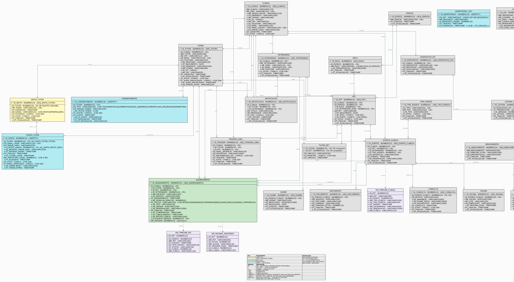

# KURA — Backend Tutor (Java / Spring Boot)

> API REST do **Portal do Tutor** da plataforma KURA — solução de continuidade do cuidado veterinário desenvolvida para o FIAP Challenge 2026 (parceiro: Clyvo Vet).


---

## Sumário

1. [Contexto e Arquitetura](#1-contexto-e-arquitetura)
2. [Stack Tecnológica](#2-stack-tecnológica)
3. [Como Executar](#3-como-executar)
4. [Variáveis de Ambiente](#4-variáveis-de-ambiente)
5. [Referência da API](#5-referência-da-api)
6. [Banco de Dados e Migrations](#6-banco-de-dados-e-migrations)
7. [Testes](#7-testes)
8. [Gestão de Configuração dos Artefatos](#8-gestão-de-configuração-dos-artefatos)
9. [Equipe e Divisão de Trabalho](#9-equipe-e-divisão-de-trabalho)

---

## 1. Contexto e Arquitetura

O KURA é um sistema com dois backends distintos: este repositório — **Java/Spring Boot** — atende o **aplicativo móvel do Tutor**, enquanto um backend **.NET 10** atende o **front-end web da Clínica**. Ambos compartilham um único schema Oracle 19c hospedado na infraestrutura da FIAP.

```
┌─────────────────────┐                       ┌─────────────────────┐
│  App Mobile Tutor   │                       │  Front da Clínica   │
│  (React Native)     │                       │  (Web)              │
└──────────┬──────────┘                       └──────────┬──────────┘
           │ JWT (Java)                                  │ JWT (.NET)
           ▼                                             ▼
┌─────────────────────┐    GET /agenda        ┌─────────────────────┐
│  Backend Tutor      │◄─────────────────────►│  Backend Clínica    │
│  Spring Boot 3.2    │    PATCH /status      │  .NET 10            │
│  :8081/api          │   (NR_VERSION sync)   │  :8080              │
└──────────┬──────────┘                       └──────────┬──────────┘
           └─────────────────────┬───────────────────────┘
                                 ▼
              ┌─────────────────────────────────────┐
              │  Oracle 19c — oracle.fiap.com.br    │
              │  :1521/orcl  (schema compartilhado) │
              └─────────────────────────────────────┘
```

### 1.1 Bounded Contexts

A estrutura de pacotes segue a organização **contexto primeiro, camada depois**. Cada bounded context é responsável por tabelas específicas do banco e expõe seus próprios controllers, services e repositories.

```
br.com.clyvo.kura.tutor/
├── auth/           Login · Refresh · Logout · infraestrutura JWT
├── onboarding/     Registro por convite (consome token emitido pelo .NET)
├── tutor/          Tutor · Pet · Espécie · Raça (leitura de dados do .NET)
├── timeline/       VW_TIMELINE_PET · VW_VACINAS_VENCENDO (views Oracle, read-only)
├── consentimento/  Rastreamento de consentimentos LGPD · Chave de idempotência
├── agendamento/    Agendamentos (shared-write com .NET via @Version)
└── shared/         SecurityConfig · GlobalExceptionHandler · CorrelationIdFilter · CacheConfig
```

Documentação completa das decisões arquiteturais em [`docs/architecture.md`](docs/architecture.md).

### 1.2 Boundary Java ↔ .NET

| Tabela | Owner | Acesso Java |
|---|---|---|
| `CONTA_TUTOR` | **Java** | Escrita exclusiva |
| `CONSENTIMENTO` | **Java** | Insert-only (histórico LGPD) |
| `IDEMPOTENCY_KEY` | **Java** | Escrita exclusiva |
| `AGENDAMENTO` | **Compartilhada** | Java: POST / PUT / DELETE (tutor); .NET: PATCH ST_STATUS (vet) |
| `TUTOR`, `PET`, `INVITE_TUTOR`, `CLINICA`, `VETERINARIO` | **.NET** | Somente leitura (`@Immutable`) |
| `ESPECIE`, `RACA` | **.NET** | Somente leitura + cache Caffeine |

Concorrência em `AGENDAMENTO` gerenciada por `@Version` (`NR_VERSION`). Escrita com versão desatualizada retorna **HTTP 409 Conflict** em ambos os backends.

### 1.3 Principais Decisões de Design

| Preocupação | Decisão | Justificativa |
|---|---|---|
| **Autenticação** | JWT stateless — access token 15 min + refresh 7 dias com rotação BCrypt | Minimiza janela de abuso; revogação sem estado compartilhado |
| **Onboarding** | Exclusivamente por convite (`POST /auth/register-invite`) | Convites são emitidos pelo .NET; Java os consome atomicamente em uma única transação |
| **Concorrência** | Optimistic locking (`@Version`) em `AGENDAMENTO` | Evita deadlocks por lock pessimista entre backends distintos |
| **Idempotência** | Tabela `IDEMPOTENCY_KEY` (sem Redis) | Segura em rollback — a chave é gravada na mesma transação que a operação protegida |
| **Cache** | Caffeine in-process apenas para `ESPECIE` / `RACA` | São catálogos estáticos; entidades mutáveis (`Tutor`, `Pet`) nunca são cacheadas |
| **Envelope de erro** | Subconjunto do RFC 7807 (`status`, `error`, `message`, `path`, `correlationId`) | Contrato consistente; cada request recebe `X-Correlation-Id` para rastreamento no servidor |
| **Gestão de schema** | Flyway V1–V5 (idempotentes, compatíveis com Oracle 19c) | Java e .NET escrevem no mesmo schema; todo DDL deve ser versionado para evitar drift |

### 1.4 Diagrama Entidade-Relacionamento (Notação Barker via PlantUML)



---

## 2. Stack Tecnológica

| Tecnologia | Versão | Uso |
|---|---|---|
| Java | 21 | Linguagem (LTS) |
| Spring Boot | 3.2.5 | Framework da aplicação |
| Spring Data JPA · Hibernate 6 | BOM | ORM / persistência |
| Spring Security | BOM | Autenticação stateless |
| jjwt | 0.12.6 | Geração e validação de JWT |
| Springdoc OpenAPI | 2.5.0 | Swagger UI |
| Caffeine | BOM | Cache in-process (espécies / raças) |
| Flyway | BOM | Versionamento de schema (V1–V5) |
| Oracle 19c / 23c | — | Banco de dados em produção (FIAP) |
| H2 | BOM | Banco em memória (perfil dev) |
| JUnit 5 · Mockito · AssertJ | BOM | Testes unitários e de integração |
| Lombok | BOM | Redução de boilerplate |
| Docker · Docker Compose | — | Containerização |

> **Atenção:** o Spring Boot está fixado na versão **3.2.5**. O Springdoc OpenAPI 2.5.0 é incompatível com Boot 4.x. Não faça upgrade sem verificar a compatibilidade do Swagger.

---

## 3. Como Executar

### 3.1 Docker Compose (recomendado)

```bash
git clone https://github.com/FelipeFerrete/backend-tutor-java.git
cd backend-tutor-java

# Copie o exemplo e preencha JWT_SECRET (mín. 64 bytes) e credenciais do banco
cp docker-compose.override.yml.example docker-compose.override.yml

docker compose up --build
```

Aguarde ~90 segundos para o health-check do Spring passar. Acesse:

| Recurso | URL |
|---|---|
| API base | `http://localhost:8081/api` |
| Swagger UI | `http://localhost:8081/api/swagger-ui/index.html` |
| Health | `http://localhost:8081/api/actuator/health` |

### 3.2 Maven local — Perfil dev (H2 em memória, sem Oracle)

```bash
# Requer Java 21 e Maven 3.9+
mvn spring-boot:run -Dspring-boot.run.profiles=dev
```

Endpoints adicionais no perfil dev:

| Recurso | URL |
|---|---|
| H2 Console | `http://localhost:8081/api/h2-console` |
| JDBC URL | `jdbc:h2:mem:kuradb` · usuário `sa` · senha *(vazia)* |

O Flyway cria o schema e executa os seeds automaticamente. Um **token de convite** pronto para testes locais é inserido pelos seeds:

```
550e8400-e29b-41d4-a716-446655440000
```

### 3.3 Produção — Oracle FIAP

```bash
export DB_URL="jdbc:oracle:thin:@oracle.fiap.com.br:1521/orcl"
export DB_USERNAME="RM562999"
export DB_PASSWORD="<senha>"
export JWT_SECRET="$(openssl rand -base64 64)"
export CORS_ALLOWED_ORIGINS="https://seu-frontend.app"

mvn spring-boot:run -Dspring-boot.run.profiles=prod
```

Em produção, `ddl-auto: validate` está ativo — o Hibernate valida o schema contra os mapeamentos das entidades na inicialização. Qualquer divergência impede a aplicação de subir. Isso é intencional.

---

## 4. Variáveis de Ambiente

| Variável | Default dev | Obrigatória em prod |
|---|---|---|
| `SPRING_PROFILES_ACTIVE` | `dev` | ✅ (`prod`) |
| `DB_URL` | H2 in-memory | ✅ `jdbc:oracle:thin:@//host:1521/orcl` |
| `DB_USERNAME` | `sa` | ✅ |
| `DB_PASSWORD` | *(vazio)* | ✅ |
| `JWT_SECRET` | String dev insegura | ✅ mín. 64 bytes — `openssl rand -base64 64` |
| `JWT_ACCESS_EXPIRATION_MINUTES` | `15` | ❌ |
| `JWT_REFRESH_EXPIRATION_DAYS` | `7` | ❌ |
| `CORS_ALLOWED_ORIGINS` | `http://localhost:8081,http://localhost:19006` | ✅ |

Copie `.env.example` para `.env` e preencha os valores de produção antes do deploy.

---

## 5. Referência da API

Documentação interativa completa: **[Swagger UI](http://localhost:8081/api/swagger-ui/index.html)**

Collection Postman: [`docs/postman/kura-tutor.postman_collection.json`](docs/postman/kura-tutor.postman_collection.json)

### Auth e Onboarding

| Método | Endpoint | Auth | Descrição |
|---|---|---|---|
| `POST` | `/auth/register-invite` | Pública | Onboarding por convite — cria conta + consentimentos LGPD + emite par JWT |
| `POST` | `/auth/login` | Pública | Autenticação email/senha → access + refresh token |
| `POST` | `/auth/refresh` | Pública | Rotação de refresh token (invalida o anterior) |
| `POST` | `/auth/logout` | JWT | Invalida o hash do refresh token armazenado |

### Tutor e Pets

| Método | Endpoint | Auth | Descrição |
|---|---|---|---|
| `GET` | `/tutores/{id}` | JWT | Perfil do tutor |
| `GET` | `/tutores` | JWT | Lista tutores com filtros (nome, cidade, estado) |
| `GET` | `/tutores/{id}/pets` | JWT | Pets ativos (paginado, verificação de posse) |
| `GET` | `/pets/{idPet}/timeline` | JWT | Linha do tempo clínica do pet |
| `GET` | `/tutores/{idTutor}/vacinas-vencendo` | JWT | Vacinas vencendo nos próximos 30 dias |

### Consentimento LGPD

| Método | Endpoint | Auth | Descrição |
|---|---|---|---|
| `GET` | `/tutores/{idTutor}/consentimentos` | JWT | Estado atual dos consentimentos (último por tipo) |
| `POST` | `/tutores/{idTutor}/consentimentos` | JWT | Registrar aceite ou revogação (header `Idempotency-Key` obrigatório) |
| `GET` | `/tutores/{idTutor}/lgpd/relatorio` | JWT | Relatório de dados pessoais (LGPD art. 18, I) |
| `GET` | `/tutores/{idTutor}/lgpd/consentimentos` | JWT | Histórico completo de consentimentos |

### Agendamentos

| Método | Endpoint | Auth | Descrição |
|---|---|---|---|
| `GET` | `/agendamentos` | JWT | Lista agendamentos (filtros: status, dataInicio, dataFim, tipo) |
| `POST` | `/agendamentos` | JWT | Criar agendamento |
| `PUT` | `/agendamentos/{id}` | JWT | Atualizar — `nrVersion` obrigatório (optimistic lock) |
| `DELETE` | `/agendamentos/{id}` | JWT | Cancelar (soft delete) |
| `PATCH` | `/agendamentos/{id}/cancelar` | JWT | Cancelar com motivo explícito |

### Catálogo (Público)

| Método | Endpoint | Auth | Descrição |
|---|---|---|---|
| `GET` | `/especies` | Pública | Lista de espécies (cache Caffeine, TTL 6h) |
| `GET` | `/racas` | Pública | Lista de raças (cache Caffeine, TTL 6h, `?especieId=`) |

### Códigos HTTP

| Status | Significado |
|---|---|
| `201` | Recurso criado com sucesso |
| `204` | Sucesso sem conteúdo (logout, soft-delete) |
| `400` | Falha de validação (Bean Validation, senha fraca, payload mal-formado) |
| `401` | JWT ausente, inválido ou expirado |
| `403` | JWT válido, mas sem permissão |
| `404` | Recurso não encontrado |
| `409` | Conflito — convite reutilizado, violação de optimistic lock ou unique key |
| `410` | Gone — token de convite expirado |
| `422` | Não processável — tutor inativo ou aviso de privacidade pendente |
| `423` | Bloqueado — conta travada após 5 tentativas de login consecutivas falhas |
| `500` | Erro interno do servidor (registrado com correlation ID) |

---

## 6. Banco de Dados e Migrations

Todo DDL é gerenciado pelo **Flyway**. Nenhum `ALTER TABLE` é aplicado diretamente.

| Migration | Conteúdo |
|---|---|
| `V1__initial_schema.sql` | Schema base completo — 14 tabelas, 4 sequences, 2 views Oracle |
| `V2__concurrency_idempotency.sql` | Índice de limpeza em `IDEMPOTENCY_KEY(DT_CRIACAO)` para o job de TTL |
| `V3__invite_based_compatibility.sql` | DDL idempotente — garante `UK_CONTA_INVITE_USED` e `IDX_INVITE_TOKEN_ATIVO` |
| `V4__lgpd_evidencia_consentimento.sql` | Placeholder de decisão arquitetural (campos de evidência LGPD) |
| `V5__agendamento_observacoes.sql` | Colunas adicionais em `AGENDAMENTO` (observações, timestamps, FK para `EVENTO_CLINICO`) |

Arquivos em [`src/main/resources/db/migration/`](src/main/resources/db/migration/).

No perfil **dev**, o callback [`db/callback/afterMigrate__seeds_dev.sql`](src/main/resources/db/callback/) insere dados de referência (espécies, raças, clínica, tutor de teste, token de convite) usando instruções `MERGE` idempotentes.

---

## 7. Testes

```bash
# Todos os testes
mvn test

# Classe específica
mvn test -Dtest=AgendamentoServiceTest

# Método específico
mvn test -Dtest=GlobalExceptionHandlerTest#erro500DeveLogarStackTraceComCorrelationId
```

Scripts de validação estática disponíveis em [`tests/`](tests/):

```bash
bash tests/test_migrations.sh      # Valida arquivos de migration Flyway
bash tests/test_docker_setup.sh    # Valida configuração Docker
bash tests/test_diagrams.sh        # Valida presença dos arquivos de diagrama
bash tests/test_architecture.sh    # Valida estrutura do documento de arquitetura
```

---

## 8. Gestão de Configuração dos Artefatos

> Esta seção é direcionada aos **professores avaliadores da FIAP** e demonstra que todos os artefatos de software produzidos durante a Sprint 1 estão versionados, publicamente acessíveis e organizados neste repositório.

**Repositório:** [github.com/KURA-Clyvo/backend-tutor-java](https://github.com/KURA-Clyvo/backend-tutor-java)

### Índice de Artefatos

| Artefato | Caminho no Repositório | Descrição |
|---|---|---|
| **Código-fonte** | [`src/`](src/) | Pacotes Java organizados por bounded context (`auth`, `onboarding`, `agendamento`, `consentimento`, `tutor`, `timeline`, `shared`) |
| **Diagrama Entidade-Relacionamento (DER)** | [`docs/diagrams/der-plantuml.png`](docs/diagrams/der-plantuml.png) | DER em notação Barker — imagem PNG gerada via PlantUML |
| **DER (PlantUML fonte)** | [`docs/diagrams/der.puml`](docs/diagrams/der.puml) | Fonte PlantUML do DER, renderizável em qualquer leitor compatível |
| **DER (Oracle Data Modeler)** | [`docs/diagrams/der.dmd`](docs/diagrams/der.dmd) | Arquivo nativo Oracle Data Modeler |
| **Documento de Arquitetura** | [`docs/architecture.md`](docs/architecture.md) | Bounded contexts, decisões arquiteturais e boundary Java ↔ .NET |
| **Collection Postman** | [`docs/postman/kura-tutor.postman_collection.json`](docs/postman/kura-tutor.postman_collection.json) | Todos os endpoints com exemplos de request/response |
| **Ambiente Postman — Dev** | [`docs/postman/kura-tutor-dev.postman_environment.json`](docs/postman/kura-tutor-dev.postman_environment.json) | Variáveis para execução local (H2) |
| **Ambiente Postman — Prod** | [`docs/postman/kura-tutor-prod.postman_environment.json`](docs/postman/kura-tutor-prod.postman_environment.json) | Variáveis para execução no Oracle FIAP |
| **Cronograma de Atividades** | [`docs/timeline.md`](docs/timeline.md) | Matriz de responsabilidades e timeline semanal da sprint |
| **Migrations do Banco** | [`src/main/resources/db/migration/`](src/main/resources/db/migration/) | Flyway V1–V5: criação de schema, constraints e dados de referência |
| **Scripts de Validação** | [`tests/`](tests/) | Scripts shell para validação de arquitetura, migrations e Docker |
| **Plano de Desenvolvimento** | [`plano.md`](plano.md) | 26 tasks detalhadas de execução da Sprint 1 |
| **Containerização** | [`Dockerfile`](Dockerfile) · [`docker-compose.yml`](docker-compose.yml) | Build Docker multi-stage e configuração do Compose |

### Histórico de Contribuições

O histórico completo de commits — com autor, data e descrição de cada atividade — está disponível na aba **[Commits](../../commits/main)** do GitHub. Todos os commits seguem a convenção [Conventional Commits](https://www.conventionalcommits.org/) e referenciam o identificador da task correspondente (T01–T26).

Para auditar a autoria individualmente:

```bash
git log --format="%ad  %an  %s" --date=short
```

### Cronograma Resumido

| Semana | Período | Principais Entregáveis |
|---|---|---|
| 1 | 21–27 abr | Kick-off, definição de escopo, criação do repositório, commit inicial |
| 2 | 28 abr – 11 mai | Modelagem de entidades, rascunho do banco, decisão arquitetural |
| 3 | 16–19 mai | Infraestrutura (Docker, Flyway, perfis Spring), diagramas, documento de arquitetura |
| 4 | 19–20 mai | Segurança JWT, onboarding por convite, CRUD completo, LGPD, cache, queries customizadas |
| 5 | 20–21 mai | Tratamento de exceções, Swagger, logging estruturado, Postman, fixes de integração, release `v0.1.0-sprint1` |

---

## 9. Equipe e Divisão de Trabalho

**Disciplina:** Java Advanced · **Instituição:** FIAP · **Ano:** 2026

| Membro | RM | Papel |
|---|---|---|
| **Felipe Ferrete** | RM562999 | Tech Lead · .NET Backend Clínica · Integração IoT / IA |
| **Nikolas Brisola** | RM564371 | Java Backend Tutor (este repositório) |
| **Guilherme Sola** | RM563674 | Mobile Tutor · UX Design |
| **Gustavo Bosak** | RM566315 | Mobile Clínica · QA |
| **Clayton Alves** | RM562285 | DevOps · Banco de Dados Oracle |

### Backend Java — Contribuições Específicas

**Nikolas Brisola** foi responsável pelo setup inicial do projeto Spring Boot, pela configuração base do Maven, pela primeira iteração do mapeamento das entidades de domínio (`Tutor`, `Pet`, `Especie`, `Raca`, `Agendamento`) e pelo rascunho inicial do schema do banco (v1 e v2).

**Felipe Ferrete** liderou a refatoração arquitetural para a estrutura de bounded contexts (plano v5), a lógica de integração cross-API com o backend .NET (optimistic locking, onboarding por convite, boundaries `@Immutable`), a camada completa de segurança (rotação de refresh token JWT, proteção brute-force), todas as migrations Flyway (V1–V5), o DER, a collection Postman e a documentação técnica completa.

O detalhamento por task, incluindo a timeline semanal, está disponível em [`docs/timeline.md`](docs/timeline.md).

---

## Licença

Projeto acadêmico — FIAP Challenge 2026. Parceiro: **Clyvo Vet**.
